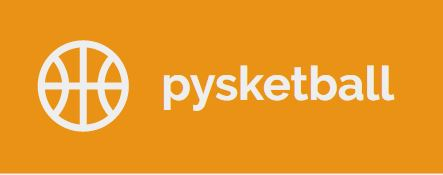

# pysketball 

 [](https://codecov.io/gh/UBC-MDS/pysketball) 

[](https://pysketball.readthedocs.io/en/latest/?badge=latest)

This package is designated for all NBA enthusiasts! This package works
to scrape online tabular data from ESPN NBA website into a csv file. It
also includes various functions to create graphs and statistical
analysis for your interest (such as boxplots, player rankings by stats,
and a summary statistics table).

An example of the ESPN NBA 2018/19 Regular season player stats can be
found in the following url:

https://www.espn.com/nba/stats/player/_/season/2019/seasontype/2


### Installation:

```
pip install -i https://test.pypi.org/simple/ pysketball
```

### Functions
- `nba_scraper`
  * Scrapes data from ESPN NBA data into a csv file. User can specify the year of the season
  (2016, 2017, etc) and the season type (regular or playoffs).
  
- `nba_boxplot`
  * Creates a boxplot of the categorical variable of interest on the y-axis and 
   the stat of interest on the x-axis.
   
- `nba_ranking`
  * Generates a ranking and a visualization based on a column of a dataset  
  
- `nba_team_stats`
  * Generate summary stats for NBA teams. The function provides descriptive statistics of NBA data for teams and player positions if specified.


### Documentation
The official documentation is currently in development and not available now. We estimate that it will be hosted on "Read the Docs" by end March 2020: 

<https://pysketball.readthedocs.io/en/latest/>

### Usage and Testing Instructions/Requirements

The `pysketball` package uses the Selenium tool as part of its `nba_scraper` function. Thus, it is necessary to install a webdriver for Selenium's automated driver web browsing. 

To streamline the package, the `nba_scraper` function has been configured to use `chromedriver`. Thus, please ensure that `chromedriver` is installed. 

__Step 1: Chromedriver installation__

If you are using Linux, you can use the following command:
```sh
sudo apt-get install chromium-chromedriver
```

If you are using Mac/Apple, you can use the following command:
```sh
brew cask install chromedriver
```
For download installation, please download it from this [website](https://chromedriver.chromium.org/downloads). 

After installing, you have to determine the location of the `chromedriver binary files.

```sh
whereis chromedriver
```

With that, add it to your PATH in your `.bashrc` file for Linux and Mac users.

```sh
export PATH="<PATH_TO_CHROMEDRIVER.EXE>:$PATH"
```

For Windows, please refer to this [article guide for instructions on adding PATH variables](https://helpdeskgeek.com/windows-10/add-windows-path-environment-variable/).

__Step 2A: Testing (with `poetry` and `pytest`)__

Ensure that you have `poetry` installed in your system. To install, please see the [`poetry` installation instructions](https://python-poetry.org/docs/#installation).

Please also ensure that an internet connection is available to perform testing. 

Note that performing the tests will take about slightly under 10 minutes as some function tests perform actual scraping. Please be patient in the mean time!

When that is done, proceed to run the following code at the project repo root in Command line/Terminal.

```sh
poetry run pytest
```

To check for test coverage, proceed to run the following code at the project repo root in Command line/Terminal.

```sh
poetry run pytest --cov=pysketball tests/
```

__Step 2B: Usage of `nba_scraper`__

To use the `nba_scraper.nba_scraper` function, please also ensure that an internet connection is available to perform testing. Proceed to start Python and run the following code in Python:

```py
>>> from pysketball.nba_scraper import nba_scraper
>>> # Scrape regular season 2018/19 and return a dataframe while storing it as csv file called "nba_2018_regular.csv"
>>> nba_2018_regular = nba_scraper(season_year = 2018, season_type = "regular", csv_path = "nba_2018_regular.csv")
```

__Step 3: Usage of `nba_boxplot`, `nba_ranking` and `nba_team_stats`__


With the scraped data in the form of a `pandas.DataFrame` called `nba_2018_regular`, you can proceed to use the other functions in `pysketball`.

```py
>>> from pysketball.nba_boxplot import nba_boxplot
>>> from pysketball.nba_ranking import nba_ranking
>>> from pysketball.nba_team_stats import nba_team_stats
>>> # Scrape regular season 2018/19 and return a dataframe while storing it as csv file called "nba_2018_regular.csv"
>>> nba_boxplot(nba_2018_regular, position= "POS", teams= None, stats= "GP")
>>> nba_ranking(nba_2018_regular, 'PLAYER' , 'GP', top = 2, ascending = False, fun = 'mean')
>>> nba_team_stats.nba_team_stats(nba_2018_regular, stats_filter = ['GP', '3PM', 'FT%'],teams_filter = ['UTAH', 'PHX', 'DET'],positions_filter = ['C', 'PG'])
```

### Notes 

For more context on the column names of the scraped data set, please refer to the [dataset description file](https://github.com/UBC-MDS/pysketball/blob/master/dataset_description.md). This will help the user better understand what columns are included in the scraped data, as well as they mean.

### Credits
This package was created with Cookiecutter and the UBC-MDS/cookiecutter-ubc-mds project template, modified from the [pyOpenSci/cookiecutter-pyopensci](https://github.com/pyOpenSci/cookiecutter-pyopensci) project template and the [audreyr/cookiecutter-pypackage](https://github.com/audreyr/cookiecutter-pypackage).

### Python Ecosystem 

This `pysketball` package aims to further gain understanding of ESPN NBA data and does not have a specific fit to the Python ecosystem. There are currently some similar packages in Python such as [`nba_api`](https://pypi.org/project/nba-api/) which takes data from sources such as NBA, but we do not know of any that takes data from ESPN NBA.


